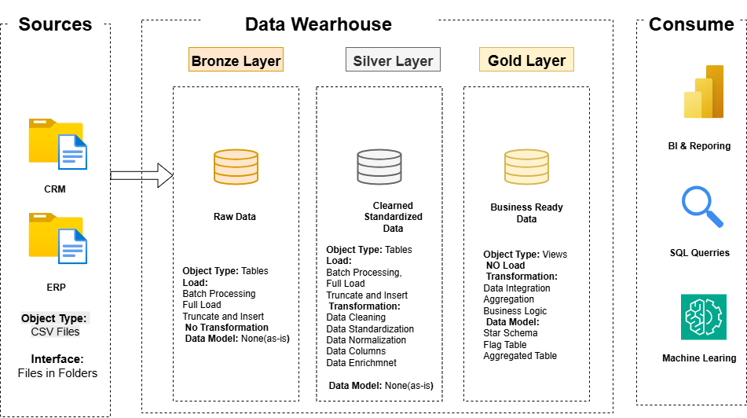

# Data Warehouse and Analytics Project

Welcome to the **Data Warehouse and Analytics Project** repository! 🚀  
This project demonstrates a comprehensive data warehousing and analytics solution, from building a data warehouse to generating actionable insights. Designed as a portfolio project, it highlights industry best practices in data engineering and analytics.

---

## 🏗️ Data Architecture

The data architecture for this project follows the **Medallion Architecture** with **Bronze**, **Silver**, and **Gold** layers.

### Architecture Diagram 1


1. **Bronze Layer** – Stores raw data as-is from the source systems. Data is ingested from CSV files into the SQL Server database.  
2. **Silver Layer** – This layer includes data cleansing, standardization, and normalization processes to prepare data for analysis.  
3. **Gold Layer** – Houses business-ready data modeled into a star schema required for reporting and analytics.

---

## 📖 Project Overview

This project involves:

1. **Data Architecture** – Designing a Modern Data Warehouse using Medallion Architecture (**Bronze**, **Silver**, **Gold**).  
2. **ETL Pipelines** – Extracting, transforming, and loading data from source systems into the warehouse.  
3. **Data Modeling** – Developing fact and dimension tables optimized for analytical queries.  
4. **Analytics & Reporting** – Creating SQL-based reports and dashboards for actionable insights.

🎯 This repository is an excellent resource for professionals and students looking to showcase expertise in:
- SQL Development  
- Data Architecture  
- Data Engineering  
- ETL Pipeline Development  
- Data Modeling  
- Data Analytics  

---

## 🛠️ Important Links & Tools

Everything is free to access:
- **[Datasets](datasets/)** – Project dataset (CSV files).  
- **[SQL Server Express](https://www.microsoft.com/en-us/sql-server/sql-server-downloads)** – Lightweight SQL Server edition.  
- **[SQL Server Management Studio (SSMS)](https://learn.microsoft.com/en-us/sql/ssms/download-sql-server-management-studio-ssms?view=sql-server-ver16)** – GUI for managing and interacting with databases.  
- **[GitHub](https://github.com/)** – Manage, version, and collaborate on your code.  
- **[DrawIO](https://www.drawio.com/)** – Design data architecture, models, and diagrams.  
- **[Notion](https://www.notion.com/)** – All-in-one tool for project management and documentation.  
- **[Notion Project Steps](https://thankful-pangolin-2ca.notion.site/SQL-Data-Warehouse-Project-16ed041640ef80489667cfe2f380b269?pvs=4)** – Access all project phases and tasks.

---

## 🚀 Project Requirements

### Building the Data Warehouse (Data Engineering)

#### Objective  
Develop a modern data warehouse using SQL Server to consolidate sales data, enabling analytical reporting and informed decision-making.

#### Specifications  
- **Data Sources** – Import data from two source systems (ERP and CRM) provided as CSV files.  
- **Data Quality** – Cleanse and resolve data quality issues before analysis.  
- **Integration** – Combine both sources into a single, user-friendly data model designed for analytical queries.  
- **Scope** – Focus on the latest dataset only; historization is not required.  
- **Documentation** – Provide clear documentation of the data model to support both business stakeholders and analytics teams.

---

### BI: Analytics & Reporting (Data Analysis)

#### Objective  
Develop SQL-based analytics to deliver detailed insights into:
- **Customer Behavior**  
- **Product Performance**  
- **Sales Trends**

These insights empower stakeholders with key business metrics for strategic decision-making.  

For more details, refer to [docs/requirements.md](docs/requirements.md).

## 📂 Repository Structure
```
data-warehouse-project/
│
├── datasets/                           # Raw datasets used for the project (ERP and CRM data)
│
├── docs/                               # Project documentation and architecture details
│   ├── etl.drawio                      # Draw.io file shows all different techniquies and methods of ETL
│   ├── data_architecture.drawio        # Draw.io file shows the project's architecture
│   ├── data_catalog.md                 # Catalog of datasets, including field descriptions and metadata
│   ├── data_flow.drawio                # Draw.io file for the data flow diagram
│   ├── data_models.drawio              # Draw.io file for data models (star schema)
│   ├── naming-conventions.md           # Consistent naming guidelines for tables, columns, and files
│
├── scripts/                            # SQL scripts for ETL and transformations
│   ├── bronze/                         # Scripts for extracting and loading raw data
│   ├── silver/                         # Scripts for cleaning and transforming data
│   ├── gold/                           # Scripts for creating analytical models
│
├── tests/                              # Test scripts and quality files
│
├── README.md                           # Project overview and instructions
├── LICENSE                             # License information for the repository
├── .gitignore                          # Files and directories to be ignored by Git
└── requirements.txt                    # Dependencies and requirements for the project
```
---


## 🛡️ License

This project is licensed under the [MIT License](LICENSE). You are free to use, modify, and share this project with proper attribution.
